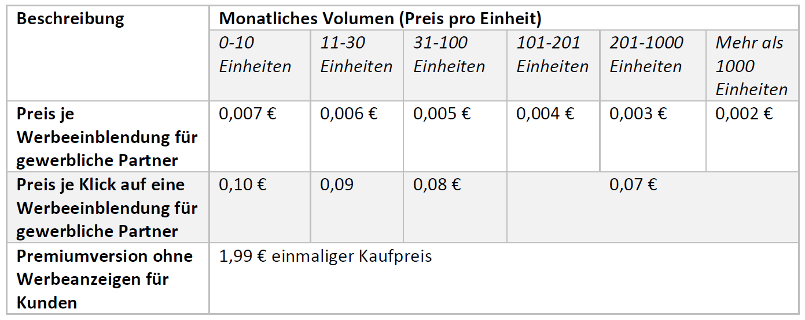

# Metriken

## Business-Metriken

---

## Preis-Metriken

## Nutzungs-Metriken
Zur Erstellung von Nutzungs-Metriken werden tatsächliche Zahlen zur Verwendung des Produkts benötigt. Diese liegen in diesem Fall noch nicht vor und können dementsprechend erst später ergänzt werden.
## Fitness Funktionen
### 1. Randbedingung: Maximale Laufzeit für die Eintragung einer Aktivität
Die maximale Ladezeit für die Eintragung einer Aktivität in der Anwendung sollte eine Sekunde dauern.
### 2. Randbedingung: Maximale Ausfallzeiten der Anwendung und Schnittstellen
Die Anwendung und die Schnittstellen dürfen maximal 15 Sekunden pro Stunde (≈ 99,583%), 1 Minute pro Tag (≈ 99,931%), 7 Minuten pro Monat (≈ 99,984%) und 30 Minuten pro Jahr (≈ 99,994%) nicht verfügbar sein.
### 3. Randbedingung: Maximale Wartezeit auf eine Antwort des Kundenservices
Bei Anfragen der Benutzer sollte eine Antwort innerhalb von 48 Stunden nach dem Eingang der Anfrage erfolgen.
## Operational-Metriken
Zur Erstellung von Operational-Metriken werden Informationen benötigt, die für den Betrieb des Services notwendig sind. Diese liegen in diesem Fall noch nicht vor und können dementsprechend erst später ergänzt werden.

# Alert Szenarien
## 1. Alert-Szenario

## 2. Alert-Szenario

## 3. Alert-Szenario
