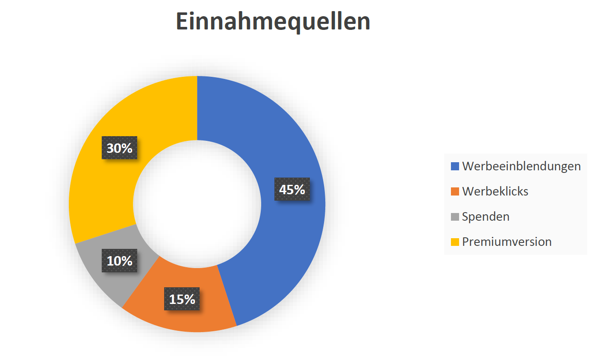

# Metriken

## Business-Metriken

Für die Ermittlung der Prozentwerte haben wir uns überlegt, wie viel Geld wir prozentual aus welchen Einnahmequellen erhalten würden.

Zur Ermittlung der Prozentzahlen haben wir ein Budget von 5.000 € auf die verschiedenen Kostenfaktoren aufgeteilt. Den Kostenfaktoren stehen folgende Beträge zur Verfügung.
* Planung: 250 €
* Programmierung: 1.900 €
* Design: 450 €
* Marketing: 1.150 €
* Weiterentwicklung: 900 €
* Serverkosten im Jahr: 350 €
### Erfolgsbemessung
* durchschnittlich sinkender Verlauf des CO2 Ausstoßes eines Nutzers über die Dauer der Erfassung
* Anzahl der gepflanzten Bäume, die auf die Anzahl der Nutzer zurückführen

## Preis-Metriken

Dabei unterscheiden wir zwischen Werbeeinblendungen und Klicks auf eine Werbeeinblendung:
Das gewährleistet uns eine sichere Einnahmequelle für eine bessere Planung bei uns und beim Werbepartner bzgl. Einnahmen bzw. Ausgaben.
Außerdem entsteht durch das Klickverfahren eine faire Bemessung des zu zahlenden Preises, durch nur das Bezahlen von tatsächlich erfolgreichen Werbeeinblendungen.
## Nutzungs-Metriken
* Screen Time pro Nutzer
* Eingetragene CO2 ausstoßende Aktivitäten pro Nutzer
* Empfehlungen durch Einladungslink pro Nutzer
* Swipen in den täglichen Tipps pro Nutzer
## Fitness Funktionen
### 1. Randbedingung: Maximale Laufzeit für die Eintragung einer Aktivität
Die maximale Ladezeit für die Eintragung einer Aktivität in der Anwendung sollte eine Sekunde dauern.
### 2. Randbedingung: Maximale Ausfallzeiten der Anwendung und Schnittstellen
Die Anwendung und die Schnittstellen dürfen maximal 15 Sekunden pro Stunde (≈ 99,583%), 1 Minute pro Tag (≈ 99,931%), 7 Minuten pro Monat (≈ 99,984%) und 30 Minuten pro Jahr (≈ 99,994%) nicht verfügbar sein.
### 3. Randbedingung: Maximale Wartezeit auf eine Antwort des Kundenservices
Bei Anfragen der Benutzer sollte eine Antwort innerhalb von 48 Stunden nach dem Eingang der Anfrage erfolgen.
## Operational-Metriken
Zur Erstellung von Operational-Metriken werden Informationen benötigt, die für den Betrieb des Services notwendig sind. Diese liegen in diesem Fall noch nicht vor und können dementsprechend erst später ergänzt werden.

# Alert Szenarien
## 1. Alert-Szenario

## 2. Alert-Szenario

## 3. Alert-Szenario

