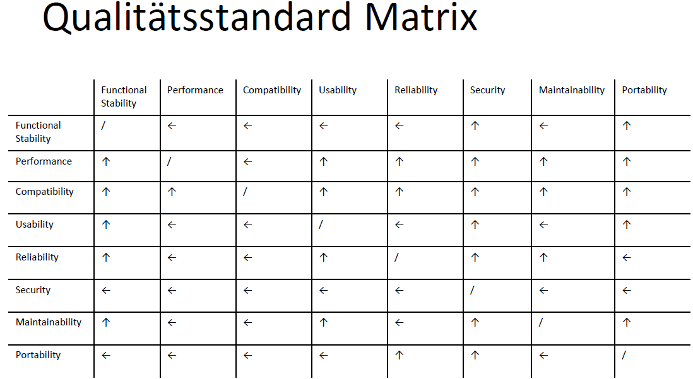

# Software Produkt Qualitäten

In Anbetracht der App, die programmiert werden soll, wurde sich auf die folgende Reihenfolge der Charakteristiken geeinigt.

1.Security\
2.Functional Stability\
3.Usability\
4.Reliability\
5.Performence\
6.Portability\
7.Maintainablity\
8.Compatiblity

## Security
Die höchste Priorität hat bei uns das Schützen der sensiblen Nutzerdaten vor unberechtigten Zugriffen. Dies steht im Zusammenhang einerseits mit dem Verlust des Vertrauens der Nutzer, falls Daten gestohlen werden sollten, und andererseits mit den auftretenen Bußgeldzahlungen beim Verletzen der DSGVO.

## Functional Stability
Die Funktionen die unsere App anbietet, sollen sowohl unsere, als auch viemehr die Erwartungen unserer Nutzer erfüllen. Die tatsächlichen Ergebnisse sollen die Zielergebnisse möglich nah treffen. Dies beinhaltet beispielsweise die maximale Ausfallzeit der Anwendung und Schnittstellen oder die Laufzeit für das Eintragen einer neuen Aktivität.

## Usability
Die Bedienung unsere App soll den Nutzer zufriedenstellen. Die App soll visuell unser umweltbewusstes Image vertreten und die Nutzung soll einfach und effektiv sein. Der Nutzer soll möglichst effizient durch die App navigieren und ihre Funktionen bedienen können.

## Reliability
Bei der Entwicklung der App wird besonders auf ihre Verlässlichkeit geachtet. Die App soll trotz möglicher Serverausfälle, Hardware-/Softwarefehler oder während kurzzeitiger Engpässe verlässlich laufen. Dadurch kann die Usability weiter gesteigert werden. Die höhere Zufriedenheit der Nutzer führt folglich zu einer höheren Wahrscheinlichkeit, dass die aktuellen Nutzer gehalten werden können und dass die App weiterempfohlen wird.

## Performance
Die möglich einsatzbaren Ressourcen sind eingeschränkt, da es sich um ein ehrenamtliches Projekt handelt, dass in erster Linie von Spenden und Ivestitionen abhängt. Nichtsdestotrotz wird versucht, die eingesetzten Ressourcen optimal einzusetzen, um den Nutzer die bestmögliche Performance anzubieten.

## Portability
Die App soll auf IOS und Android-Geräten laufen, damit eine breitere Kundenbasis angesprochen werden kann. Des weiteren ist geplant, die App in Zukunft auch als Desktopanwendung anzubieten, weshalb auf Faktoren wie die Anpassparkeit oder die Installierbarkeit auf verschiedenen System geachtet werden muss.

## Maintainability
In der App wird besonders auf die Stablität der Funktionen geachtet, wodurch davon ausgegangen werden kann, dass diese Funktionen nur wenig Fehler besitzen. Weiterhin müssen die Funktionen unserer App nicht laufend verbessert werden bzw. neue hinzugefügt werden, da dies nicht der Vision unserer App entspricht.

## Compatiblity
Unsere App ist fast vollständing unabhängig von anderen Apps, weshalb dieser Charakteristik die niedrigste Priorität zugeordnet wurde. 
