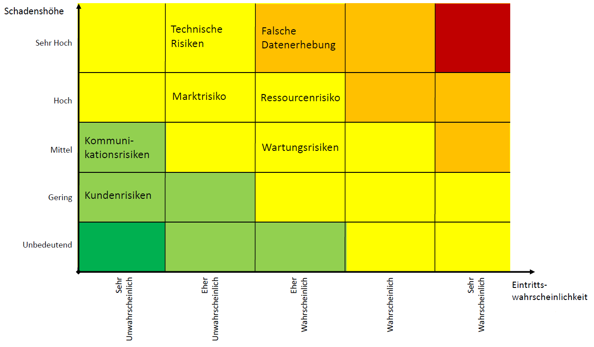

# Risiken
## Definition von Risikoklassen
* Marktrisiko
* Kommunikationsrisiken
* Ressourcenrisiko
* Technische Risiken
* Kundenrisiken
* Wartungsrisko

## Wahrgenommene Risiken
## Einordnung der Risiken in Risikoklassen

## Bewertung und Strategie zur Mitigation
