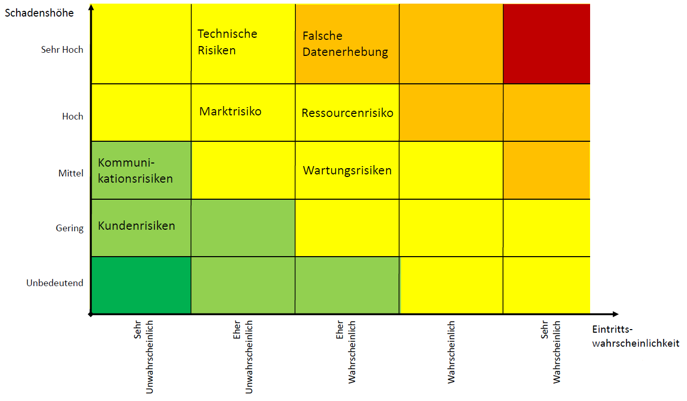

# Risiken
## Definition von Risikoklassen
### Marktrisiko

  Vor der Entwicklung der App muss eine eingehende Untersuchung der Marktbedürfnisse durchgeführt werden. Es ist wichtig, da die App    nicht auf den Markt kommen sollte, ohne den Bedürfnissen der Kunden zu entsprechen.

### Kommunikationsrisiken

  Die Kommunikation zwischen dem Kunden und dem Entwickler muss optimiert werden. Da die Entwickler in diesem Fall ihre eignen Kunden sind, ist es wichtig, dass eine gute Kommunikation zwischen dem Product Owner und dem Team herrscht, um Missverständnisse und mögliche falsche Fuktionen zu vermeiden. Die Entwcikler müssen ein klares Bild haben, wie die App auszusehen hat, dass bei den Reviews keine größeren Änderungen vorgenommen werden müssen, die Zeit und Kosten intenisv sind.

### Ressourcenrisiko

  Es sollten ausreichend Ressourcen berechnet werden. Die Entwicklung ist abhängig von Speicher, Server und dem entsprechenden Fachpersonal. Die Funktionalität der mobilen Anwendung hängt von der Verfügbarkeit dieser Ressourcen ab. Zudem ist es wichtig, dass die Anwendung plattformunabhängig ist, da sie in meherene App Stores angeboten werden soll.

### Technische Risiken
  * Algorithmen: Algorithmen sollten genügend Platz haben, dass es nicht zu Speicher oder anderen Problemen kommt.
  * Plattform: Die Plattform sollte für die Anwendung passend sein und Stabild und sicher laufen.
  * Testing: Die Fehler, die nach dem Launch der mobilen App auftreten, sind schwierig und teuer zu beheben. Also ist es wichitig, alle möglichen Szenarien beim Testen auszuprobieren.

     Allgemein ist Testen sehr wichtig, dass die wesentlichen Funktionalitäten problemlos gehen. Verschiedenste Modelle sollten getestet werden, da die App auf Geräten mit unterschiedlichen Bildschirmgrößen, Auflösungen und verschiedener Anbieter laufen wird.

### Kundenrisiken

  Damit eventuell auftretende Missverständnisse zwischen den Entwicklern, dem Marketing und dem Product Owner vermieden werden, sollte alles genaustens dokumentiert werden und für Nicht-Entwickler entsprechend dargestellt werden.

### Wartungsrisko

  Mit dem Launch einer mobilen Anwendung sind Risiken verbunden. Daher ist der Support nach der Veröffentlichung der App das Wichtigste für den Produkterfolg. Es ist wichtig, die Funktionen der Software regelmäßig zu aktualisieren. Daher sollte die mobile Anwendung neue Änderungen in der Plattform übernehmen und Support bieten. Damit werden auch die individuellen Bedürfnisse der Kunden erfüllt, die ständige Updates und Aufmerksamkeit erfordern.

## Wahrgenommene Risiken
Diese können wir noch nicht definieren, da die Entwicklung und Planung der App noch nicht gestartet ist.
## Einordnung der Risiken in Risikoklassen

## Bewertung und Strategie zur Mitigation
* Falsche Datenerhebung:  
* Ressourcenrisiko:  
* Wartungsrisiken:  
*Technische Risiken:
* Marktrisiko:  
 
